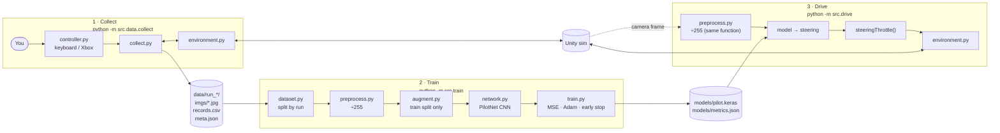

# Architecture

How the pipeline fits together, and why it is built the way it is. For setup
and the collection controls, see the [README](../README.md).

The whole project is one loop: **a human drives → frames are recorded → a CNN
learns to copy the human → the CNN drives**. This is *behavioral cloning*: the
model never gets a reward, it only imitates (image, action) pairs.



`config.py` sits underneath all three stages: image size, crop, paths,
hyperparameters and throttle settings live there and nowhere else.

## Repository map

| Path | Role |
| --- | --- |
| `config.py` | Single source of truth for every number the stages must agree on |
| `src/input/controller.py` | Keyboard (default) or Xbox input, behind one `poll()` interface |
| `src/data/collect.py` | Teleop capture: pairs each frame with the human's action |
| `src/data/dataset.py` | Reads runs, splits **by run**, builds `tf.data` pipelines |
| `src/data/preprocess.py` | The one normalisation step, shared by training and driving |
| `src/data/augment.py` | Mirror + brightness jitter, training split only |
| `src/model/network.py` | The CNN (PilotNet-style), crop included in the model |
| `src/train.py` | Fit, checkpoint the best model, early stop, write metrics |
| `src/drive.py` | Inference loop: frame → steering → throttle → sim |
| `src/sim/environment.py` | The **only** module that imports gym / gym-donkeycar |
| `src/sim/fakeenv.py` | Deterministic stand-in for the sim, used by the tests |
| `tests/` | Mirrors `src/`; each test states one behaviour of its module |

## 1 · Collect

`collectRun` (in `src/data/collect.py`) loops at about 20 FPS. Each tick it
polls the controller for steering and throttle. If recording is on, it saves
the current camera frame as a JPEG and writes one row to `records.csv`. Then it
sends the action to the sim and receives the next frame.

**Why it is built this way**

- **Record before stepping.** The saved image is the frame the human *saw*;
  the saved action is what they *did about it*. If these were one frame apart,
  the model would learn to react to the wrong picture.
- **RGB → BGR on save.** The sim produces RGB, but `cv2.imwrite` expects BGR.
  Without the conversion, training (which decodes JPEGs as RGB) would see red
  and blue swapped compared with what the sim shows at drive time.
- **Pseudo-analog keyboard.** `rampToward` slides each axis toward the held
  key and decays it back to 0 on release (`STEER_RATE`, `THROTTLE_RATE`,
  `RETURN_RATE`). This makes keyboard steering smooth enough to learn from.
  A side effect is that recorded *throttle* is 0 for most frames, which is why
  drive time ignores the model's throttle (see [Drive](#3--drive)).
- **Empty runs are discarded.** Recording starts off (press `r`). A session
  with 0 recorded frames is deleted with a warning, instead of leaving an
  empty run that would break training later.

**On disk**, a run looks like this:

```
data/run_2026-09-29_13-13-50/
├── imgs/000000.jpg …      160×120 JPEGs
├── records.csv            frame, image, steering, throttle, timestamp, speed, cte
└── meta.json              track, controller, image size, fps, frame_count
```

## 2 · Train

`trainModel` (in `src/train.py`) loads the runs, builds the model and fits it.

1. **`dataset.py`** lists runs with at least one frame and splits *whole runs*
   into train and validation (20% of runs, at least one).
2. **`preprocess.py`** converts `uint8` pixels to `float32` in `[0, 1]`.
3. **`augment.py`** (training split only) mirrors half the images left↔right
   with the steering sign flipped, then jitters brightness.
4. **`network.py`** builds the CNN.
5. **`train.py`** fits with MSE loss and Adam, keeps the checkpoint with the
   best validation loss, stops after 5 epochs without improvement, and writes
   the loss curves to `models/metrics.json`.

**Why it is built this way**

- **Split by run, not by frame.** Consecutive frames are nearly identical. A
  random per-frame split would put near-copies of training images into
  validation, and the validation loss would look good while measuring nothing.
  This is why training needs at least 2 runs.
- **Mirroring** doubles the data and cancels out a track that mostly turns one
  way. Validation and driving always see unmodified images.
- **Imbalance warning.** If more than 70% of training frames are near-straight
  (`|steering| < 0.05`), `dataset.py` warns: the model would learn to go
  straight.

### The model

PilotNet is NVIDIA's 2016 end-to-end driving CNN. The version here:

```
input 120×160×3
→ Cropping2D (drop top 40 rows: sky/horizon)     → 80×160×3
→ Conv 24 5×5 /2 → Conv 36 5×5 /2 → Conv 48 5×5 /2
→ Conv 64 3×3    → Conv 64 3×3
→ Flatten → Dropout 0.2 → Dense 100 → Dropout 0.2 → Dense 50
→ Dense 2, tanh                                   → [steering, throttle] in [-1, 1]
```

The crop is a layer **inside the model**, so drive time cannot forget it.
The `tanh` output keeps both predictions in the same `[-1, 1]` range as the
recorded labels.

## 3 · Drive

`driveLoop` (in `src/drive.py`) resets the sim, then repeats until the episode
ends: preprocess the frame with the same `preprocessImage`, run the model, take
its **steering**, compute throttle from that steering, and step the sim.

### Throttle comes from steering, not from the model

The model still has a throttle output, but drive time ignores it. Keyboard
capture makes throttle labels mostly 0 (key released) with occasional negative
values (reverse taps). A model trained on them learned to coast to a stop and
sometimes reverse: the car drove for a few seconds, backed up, then stalled.

Instead, `steeringThrottle` computes:

```
throttle = max(THROTTLE_MIN, DEFAULT_THROTTLE × (1 − THROTTLE_STEER_GAIN × |steering|))
           capped at THROTTLE_MAX
```

With the defaults (`0.35`, `0.5`, floor `0.2`, cap `0.5`) the car runs at 0.35
on straights, slows in corners, and never drops below 0.2. It can't stall or
reverse.

| steering | 0 | ±0.25 | ±0.5 | ±0.75 | ±1 |
| --- | --- | --- | --- | --- | --- |
| throttle | 0.350 | 0.306 | 0.263 | 0.219 | 0.200 |

**Tuning:** if the car runs wide in the tightest corner, lower
`DEFAULT_THROTTLE` or raise `THROTTLE_STEER_GAIN`. If it is slow everywhere,
raise `DEFAULT_THROTTLE`. Model throttle could be used again if training data
is recorded with clean throttle (for example an analog trigger held steadily).

## The train/serve contract

A behavioral-cloning model only works if drive time feeds it images exactly
like the ones it trained on. These guarantees protect that:

| Guarantee | Enforced by | What breaks without it |
| --- | --- | --- |
| Same pixel scaling | one `preprocessImage`, used by `dataset.py` and `drive.py` | Inputs out of the trained range; predictions are garbage |
| Same crop | `Cropping2D` layer inside the model | Model sees sky it never trained on |
| Same colour order | RGB → BGR conversion in `collect.py` | Red/blue swapped between training and driving |
| Same image size | `IMAGE_H`, `IMAGE_W`, `IMAGE_C` in `config.py`; `ensure_shape` in `dataset.py` | Shape errors, or silently resized inputs |
| Frame matches its action | record-before-step in `collect.py` | Model learns to react to the wrong frame |

## Supporting pieces

- **Simulator isolation.** `environment.py` is the only file that imports
  gym. Everything else uses its `reset / step / close` interface. A real car
  would replace just this file.
- **Fake simulator.** `fakeenv.py` has the same interface with no gym
  dependency. Frame *i* has every pixel set to `i % 256`, so a test can prove
  which frame was paired with which action. All tests run headless with it:

  ```bash
  pytest
  ```

## Key settings (`config.py`)

| Setting | Value | Meaning |
| --- | --- | --- |
| `IMAGE_H × IMAGE_W × IMAGE_C` | 120 × 160 × 3 | Camera frame shape |
| `CROP_TOP` | 40 | Rows removed from the top inside the model |
| `FPS_TARGET` | 20 | Capture rate during collection |
| `BATCH_SIZE`, `EPOCHS`, `LEARNING_RATE` | 64, 40, 1e-3 | Training (early stopping usually ends sooner) |
| `VAL_SPLIT` | 0.2 | Fraction of *runs* held out for validation |
| `AUGMENT_FLIP`, `BRIGHTNESS_DELTA` | True, 0.2 | Training augmentation |
| `DEFAULT_THROTTLE` | 0.35 | Drive throttle on straights |
| `THROTTLE_STEER_GAIN` | 0.5 | How much drive throttle drops in corners |
| `THROTTLE_MIN`, `THROTTLE_MAX` | 0.2, 0.5 | Drive throttle floor and cap |
| `SIM_HOST`, `SIM_PORT`, `SIM_TRACK` | env vars | Where the sim is and which track |

## Learning the codebase

1. **Read in data-flow order**, each module followed by its test:
   `config.py` → `controller.py` → `collect.py` → `dataset.py` →
   `preprocess.py` / `augment.py` → `network.py` → `train.py` → `drive.py`.
   No file is longer than about 140 lines.
2. **Break something on purpose**, predict which test fails, then run `pytest`:
   - remove the RGB → BGR conversion in `collect.py`
   - make `flipImageAndLabel` keep the steering sign
   - make `steeringThrottle` allow negative values

   Restore with `git checkout -- <file>`.
3. **Follow one frame by hand.** Pick a row in a `records.csv`, open its
   image, and decide what steering you would choose. Compare with the model.
4. **Change one setting and watch the sim**: `DEFAULT_THROTTLE`,
   `THROTTLE_STEER_GAIN`, `CROP_TOP`, `EPOCHS`.
